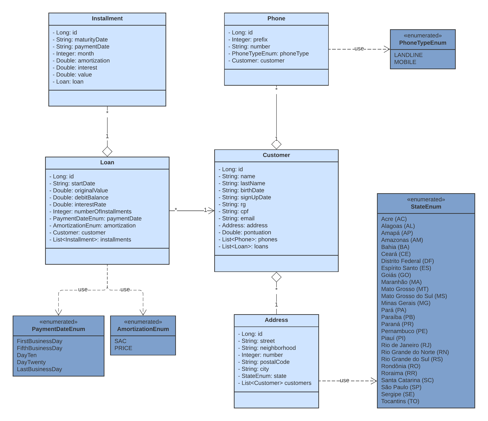

# Loan management project [UNDER CONSTRUCTION]

## Tópicos

- [Project description](#project-description)
- [Developer](#developer)
- [Current Progress](#current-progress)
- [UML](#uml)
- [Swagger endpoints](#swagger-endpoints)

## Project Description

The Loan Project provide the complete structure for a money lending company manage its loans

## Current Progress

:heavy_check_mark: `02/08/2022:` Today I finished the first sprint of the project: 
https://github.com/LagrotaGabriel/LoanApi-CRUD/blob/master/documentation/First_Sprint.pdf

## Swagger Endpoints

## UML

## Developer

[ Gabriel Lagrota](https://github.com/LagrotaGabriel)

######Back end Java developer since 12/2021

